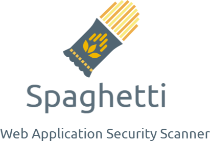

## Spaghetti - Web Application Security Scanner




## Description

Spaghetti is a powerful and versatile web application security scanner designed to uncover potential vulnerabilities in websites and web applications. This tool is built with the security professional and developer in mind, providing a comprehensive toolkit for identifying common security misconfigurations and weaknesses. 

**Spaghetti is ideal for:**

* **Security professionals:** Conducting comprehensive vulnerability assessments and penetration testing.
* **Developers:** Identifying potential security issues during the development lifecycle.
* **Website owners:** Gaining insights into their website's security posture and addressing potential risks.


## Features

### Fingerprinting

Spaghetti utilizes a robust fingerprinting engine to gather crucial information about the target website, including:

* **Server:** Identify the web server technology (e.g., Apache, Nginx, IIS).
* **Frameworks:** Detect popular web application frameworks (e.g., CakePHP, CherryPy, Django, Ruby on Rails).
* **Firewalls:** Identify common web application firewalls (e.g., Cloudflare, AWS WAF, Barracuda).
* **CMS:** Discover Content Management Systems (e.g., Drupal, Joomla, WordPress).
* **Operating System:** Determine the underlying operating system (e.g., Linux, Unix, Windows).
* **Programming Language:** Identify the programming language used (e.g., PHP, Ruby, Python, ASP).

### Discovery

Spaghetti employs a wide range of techniques to discover potential vulnerabilities, including:

* **Admin Panel Detection:** Locate hidden administrative interfaces that could expose sensitive data.
* **Apache Enumeration Users:**  Discover potentially vulnerable Apache user accounts.
* **Apache XSS:** Detect cross-site scripting vulnerabilities in Apache configurations.
* **Apache ModStatus:** Identify potential information disclosure through the use of Apache ModStatus.
* **Backdoors:** Scan for known backdoors that attackers could exploit.
* **Backup Detection:** Identify backup files that may contain sensitive information.
* **Captcha Analysis:** Analyze captcha implementations for potential bypass vulnerabilities.
* **Common Directories/Files:** Scan for common directories and files that could be misconfigured or contain sensitive data.
* **Cookie Security:** Assess the security of website cookies, including HTTPOnly flags and secure flags.
* **Multiple Index:** Identify multiple index files that could expose hidden content.
* **Information Disclosure:** Discover potential leaks of email addresses, private IP addresses, or other sensitive information.

## Installation

1. **Clone the repository:**
```bash
git clone <repo url>
```

2. **Navigate to the project directory:**
```bash
cd Spaghetti
```

3. **Install dependencies:**
```bash
pip install -r doc/requirements.txt
```

4. **Run Spaghetti:**
```bash
python spaghetti.py -h 
```

## Usage Examples

**Scan a website:**

```bash
python spaghetti.py -u https://www.example.com
```

**Scan a website and output results to a file:**

```bash
python spaghetti.py -u https://www.example.com -o results.txt
```

**Scan a website with a specific list of plugins:**

```bash
python spaghetti.py -u https://www.example.com -p plugins.txt
```

## Contribution Guidelines

Contributions to Spaghetti are highly welcomed! If you'd like to contribute, please follow these guidelines:

1. **Fork the repository.**
2. **Create a new branch for your feature or bug fix.**
3. **Make your changes and ensure they are well-documented.**
4. **Submit a pull request.**

## Disclaimer

Spaghetti is intended for educational and security testing purposes only. Using this tool for illegal activities is strictly prohibited and can have serious legal consequences. It is important to obtain permission before scanning any website or web application.

## License

Spaghetti is licensed under the GPLv3 license. See the LICENSE file for more information.
